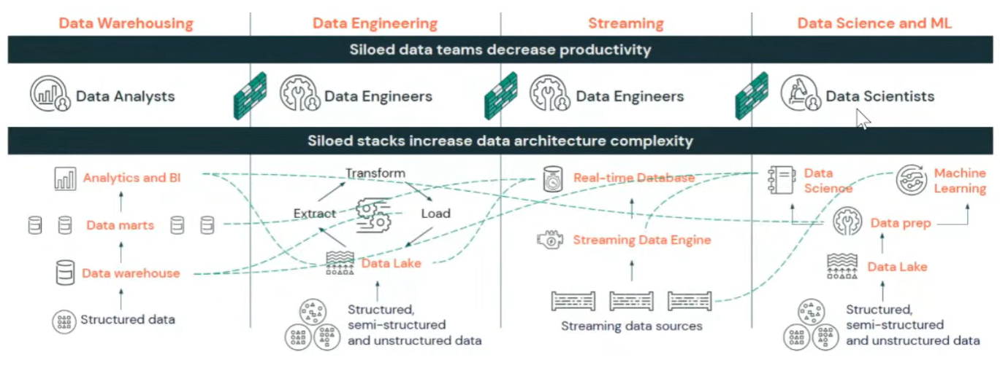
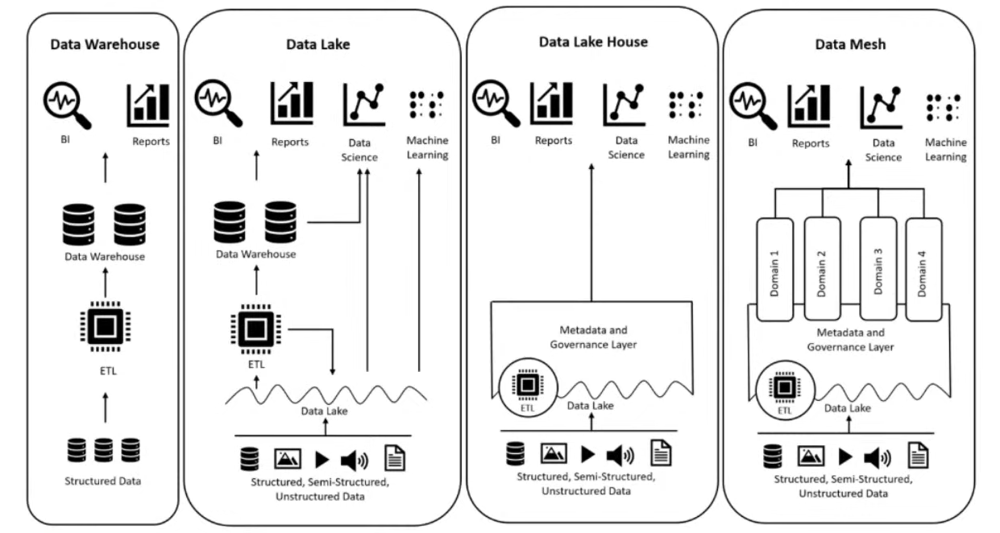
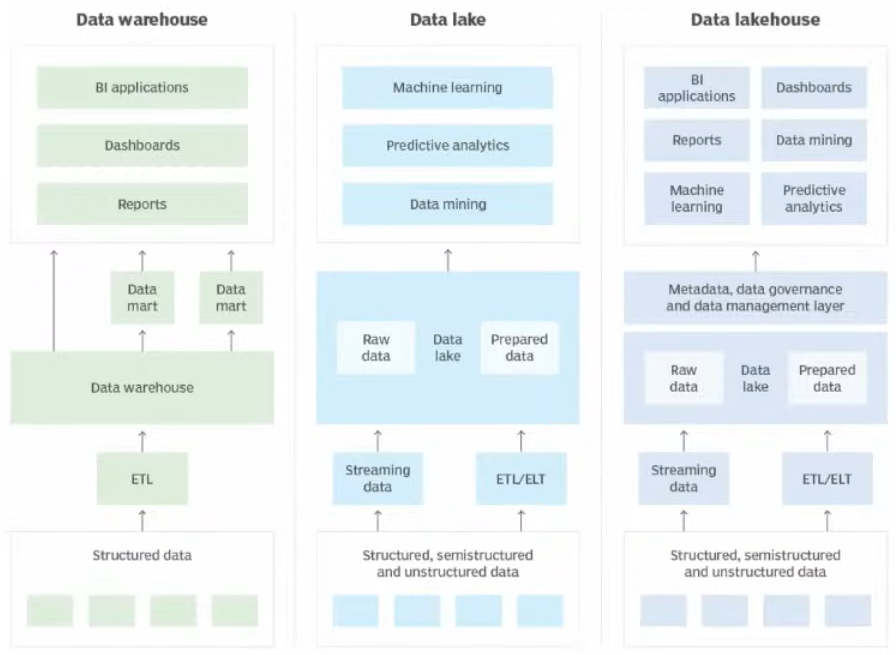
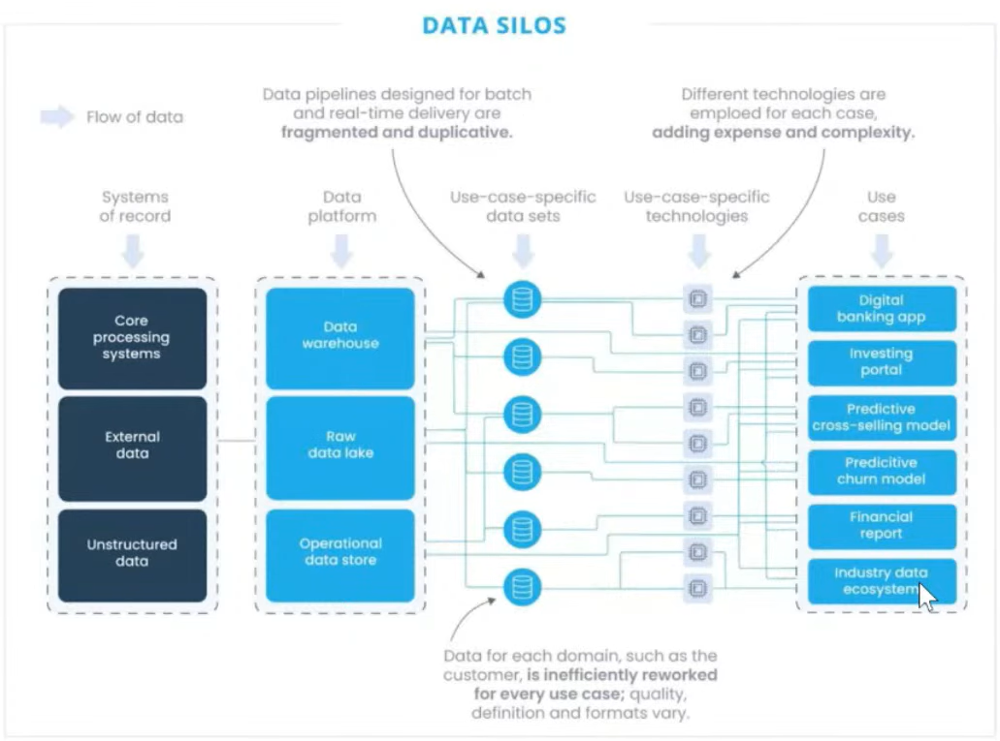

# Data Mesh | AWS | Duckdb | Taipy | dbt-core

-----

## 📋 Sobre

Construção de lakehouse.

Projeto de melhoria de plataforma de engenharia e IA para empresas.

## 📋 Problemas

O real cenário de muitas empresas é a **Ausência de Maturidade & Cenário Corporativo nas Empresas**, silos e feudos de dados departamentais, risco regulatório de vazamentos, ausência latente de governança e visibilidade de dados.

Com a desorganização dos **silos** de dados, a 1º ação necessária e padronizar e para isso primeiro devemos saber como cada estratégia funciona:

**Data Warehouse X Data Lakes x Data Lakehouses x Data Mesh**
*Diferenças, benefícios e oportunidades de geração de valor para as empresas.*

**Data Warehouse**

-----

**Data Warehouse**

Um DW é baseado em una estrutura de ETL, onde é criado ambientes apartados do banco de dados transacional com foco principal na extração e modelagem dessas informações para B.I e Reporting.
Isso significa que é muito difícil fazer ciência de dados em um ambiente DW, ou seja, esse ambiente é muito mais aderente a iniciativas tradicionais de B.I, não é um ambiente que propicia análises **ad-hoc** (Análise feita **sob demanda**, para responder perguntas específicas).

**Data Lake**

Diferente do DW, o Data Lake trás toda a massa de dados para um ambiente de dados distribuido, onde você passa de apenas analisar dados estruturados, para dados **Structured, Semi-Structured and Unstructured Data**, semelhantes ao **Data LakeHouse** e **Data Mesh**.
Outra caracteristica, é que qualquer tipo de arquivo pode entrar no seu banco de dados, CSV, PARQUET, JSON, PNG e etc, além de que o valor de um Data Lake é mais atraente que o de um DW.
Como um Data Lake possui uma grande variedade de formas para armazenar os dados, ele já possibilita atender áreas de ML e Data Science. Sendo assim, um ponto forte para Machine learning, Predictive analytics, ad-hock e Data mining

**Data Lake House**

Um **Lakehouse** já entra com a mesma capacidade de dados que um **Data Lake** e também conseguindo atender as mesmas áreas (B.I, Reports, Data Science, ML). Mas o diferencial de um Lakehouse, é suas camadas de **Medatada** e **Governança de Dados**, que não necessáriamente é uma técnologia, e sim uma estratégia. Esse modo de estratégia foi implementada pela **Databricks**.

**Data Mesh**

Já o **Data Mesh** que é o assunto abordado aqui, possui as mesmas capacidades que um Lakehouse, mas a sua diferença são os **Dominios**, que são praticamente uma separação para as especificas áreas de negócio.

**Observação**

*Tudo isso, não quer dizer que o Data Mesh é a melhor versão de todos os tipos e estratégias de dados, mas que sim é uma ferramenta/modo a mais para ser*
*considerado.*
*O que queremos aqui é decidir de acordo com as nossas necessidades e da necessidade da empresa, qual é o melhor método/tecnologia para ser usada ?.*

-----

#### Casos de Uso de Data Mesh

Data Silos é denominados quando existem diversos ambientes de dados separados entre as áreas de negocios de uma empresa, é onde o Data Mesh entra e organiza os Data Silos em **Use-case-especific**.

-----

#### Ecossistema de Contrato de Dados

Quando temos um problema de formas de consumir ou tratar um dado, temos duas partes interessantes:

**Federated Governance**

